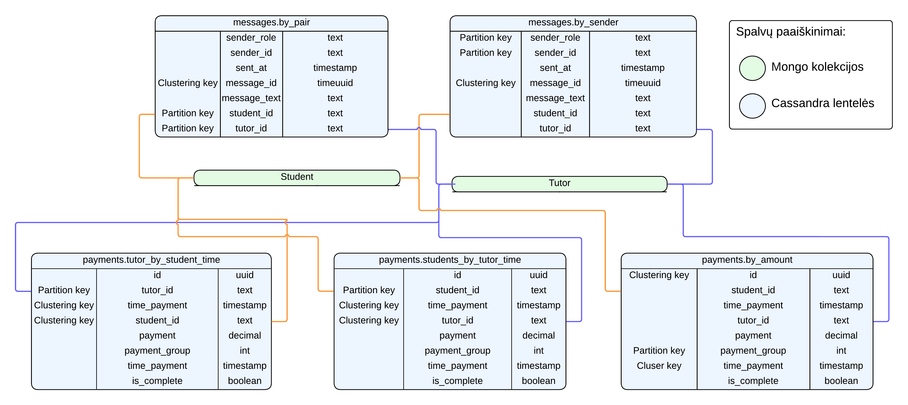
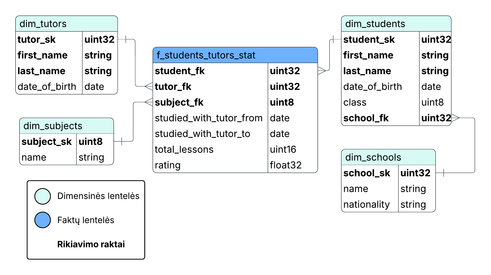

# MENDL-tutors
---

## ER diagrama

### Mongo


Diagramoje baltai pažymėtos tos esybės, kurias turime kaip fizines kolekcijas duomenų bazėje.
Geltonai žymime sujungčias leneteles (angl. *join table*), kurios nurodo, kokius duomenis išrenkame į fizines kolekcijas, modeliuodami daug su daug (angl. *many-to-many*) sąryšius.
Mėlynai žymime tai, ką mes fizinėse kolekcijose laikome objektais (viduje kolekcijos object tipas), kas nėra atskira esybė. Pavyzdžiui *subjects* diagramoje yra išskirta atskirai, kadangi modeliuojame kaip objektą, tačiau dalykams atskiros fizinės kolekcijos nedarom, tai ir žymim kita spalva.

### Cassandra



Diagramoje mėlynai pažymėtos lentelės laikomos Cassandra, o žaliai - Mongo. Ryšius su `sutdent` žymim oranžine spalva, o ryšius su `tutor` - mėlynai.

### Data warehouse integracija

Integracijai naudojome Clickhouse duomenų saugyklą (angl. *data-warehouse*). Jos diagrama pateikta žemiau.
Duomenų saugyklos faktų ir dimensijų lentelių rikiavimo raktai (angl. *ordering keys*) paryškinti. 
Jie taip pat yra ir pirminiai raktai, taigi jiems sukuriamas indeksas, šias parinkome dėl to, kad su šiais stulpeliais buvo planuota, kad darysime daugiausiai užklausų.
Išorinių raktų atitikmenų pavadinimuose pabaigoje rašome fk (iš *foreign key*), generuotų raktų (angl. *surogate key*) pabaigoje rašome sk, pavyzdžiui `tutor_sk`, `subject_sk`.
Skirtingomis spalvomis žymime faktų ir dimensijų lenteles.



## Projekto sturktūra
---

- `model/`: skriptai sukurti mongo duombazes
- `api/`: programos funkcijos (ir API)
- `app/`: Flask app'as

## Paleidimas
---

### Paleidimas su docker

```
docker build -t mendl-app:1.0 .
docker run -p 5000:5000 mendl-app:1.0
```

### Paleidimas Windows

- Be virtual environment
```
python -m app.app
```

- Su virtual environment

```
python -m venv venv

.\venv\Scripts\Activate.ps1
pip install -r requirements.txt # Jei dar neparsiųstos bibliotekos

python -m app.app
```

### Paleidimas Linux

```
# Priklauso nuo distro, gali buti python ne python3
python3 -m venv venv

source venv/bin/activate
pip3 install -r requirements.txt

python3 -m app.app
```
