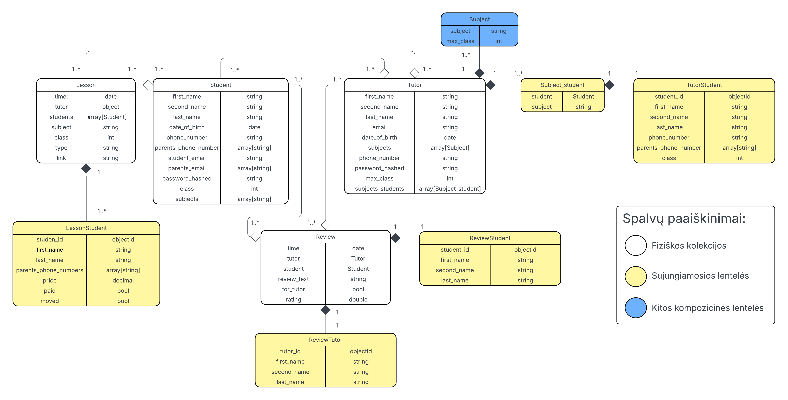

# MENDL-tutors
---

## ER diagrama



Diagramoje baltai pažymėtos tos esybė, kurias turime kaip fizines kolekcijsa duomenų bazėje.
Geltonai žymime sujungčianes leneteles (angl. *join table*), kurios nurodo, kokius duomenis išrenkame į fizines kolekcijas, modeliuodami daug su daug (angl. *many-to-many*) sąryšius.
Mėlynai žymime, tai ką mes fizinėse lentelėse laikome objektais, kas nėra atskira esybė (pvz. *subjects* yra išskirta atskirati, kadangi modeliuojame kaip objektą, tačiau dalykams atskiros fizinės kolekcijos nedarom, tai ir žymim kita spalva).

## Projekto sturktūra
---

- `model/`: skriptai sukurti mongo duombazes
- `api/`: programos funkcijos (ir API)
- `app/`: Flask app'as

## Paleidimas
---

### Paleidimas su docker

```
docker build -t mendl-app:1.0 .
docker run -p 5000:5000 mendl-app:1.0
```

### Paleidimas Windows

- Be virtual environment
```
python -m app.app
```

- Su virtual environment

```
python -m venv venv

.\venv\Scripts\Activate.ps1
pip install -r requirements.txt # Jei dar neparsiųstos bibliotekos

python -m app.app
```

### Paleidimas Linux

```
# Priklauso nuo distro, gali buti python ne python3
python3 -m venv venv

source venv/bin/activate
pip3 install -r requirements.txt

python3 -m app.app
```
